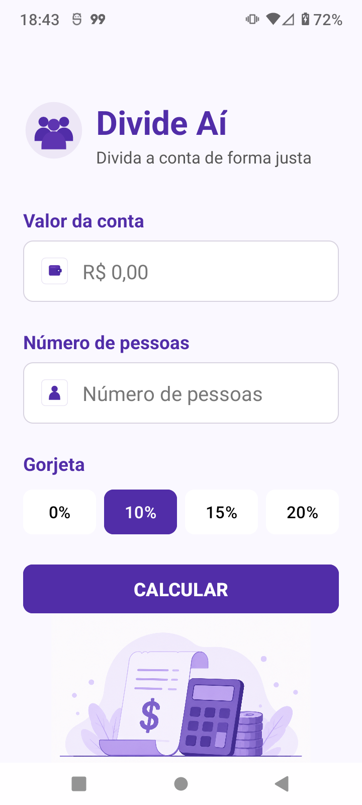
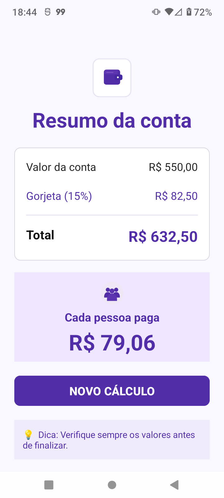

# Divide Aí 💰

Aplicativo Android para divisão de contas entre pessoas e cálculo de gorjetas.

## 📱 Funcionalidades

- Divisão da conta entre várias pessoas
- Gorjetas de 0%, 10%, 15% e 20%
- Validação dos campos
- Cálculo do valor individual
- Exibição do resultado em uma segunda tela

## 🛠️ Tecnologias

- Kotlin
- Android Studio
- XML
- Activities e Intents

- ## 📸 Screenshots

### Tela inicial

### Tela de resultado

